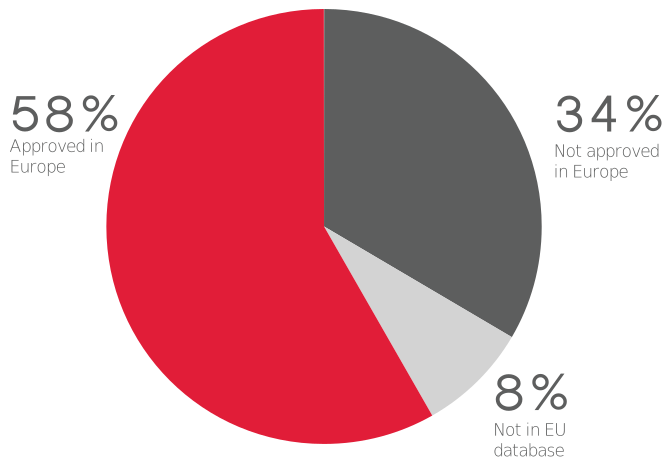

# Traditional Recipes

> Food so good, you won't mind the cancer!

Traditional recipes ([traditional.recipes](https://traditional.recipes)) is a satirical collection of recipes that include the unseen harmful chemicals used in pesticides. The goal is to raise awareness of the extent of pesticide use, their concentrations in food and environment and their possible effects on the environment and ecosystem services.

34% of the active ingredients in the Kenyan market pose a serious potential impact on human and environmental health and are withdrawn from the European market.

<p align="center">
  
</p>
<p align="right">
<span>Credit: <a href="https://routetofood.org/pesticides-in-kenya-whats-at-stake/">Route to Food Initiative, 2019</a></span>
</p>

## Development

The website is built with React and Grommet.
### Getting started
1. Install [node.js](https://nodejs.org/) and [yarn](https://yarnpkg.com/)
2. Clone this repository and run `yarn install` to install all dependencies

### Available Scripts

#### Development mode
```shell
yarn prestart && yarn start
```
The `prestart` command generates JSON validation schema and evaluates all recipe JSON files before starting up the development server, which is available at [http://localhost:3000](http://localhost:3000)

#### Tests
```shell
yarn test
```

Launches the test runner in the interactive watch mode.\
See the section about [running tests](https://facebook.github.io/create-react-app/docs/running-tests) for more information.

#### Release build
```shell
yarn prebuild && yarn build
```

Builds the app for production to the `build` folder.\
It correctly bundles React in production mode and optimizes the build for the best performance. The build is minified and the filenames include the hashes.\

See the section about [deployment](https://facebook.github.io/create-react-app/docs/deployment) for more information.